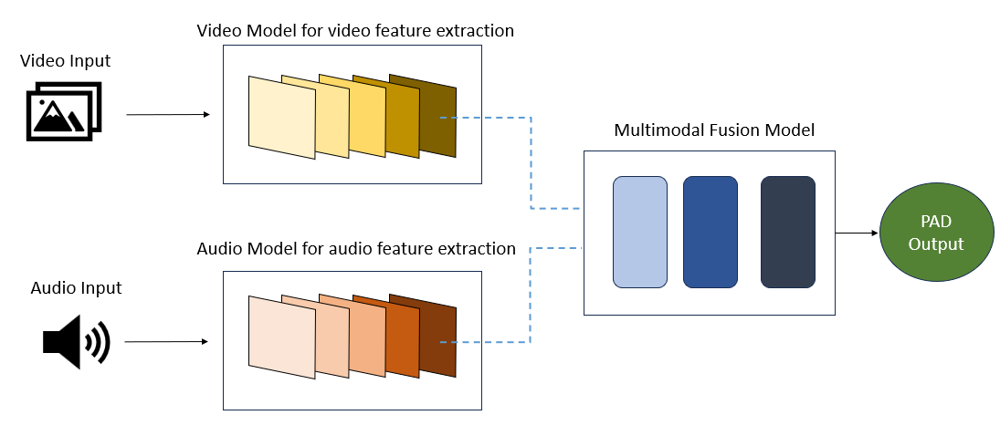

# Multimodal Transformer for Affect Analysis in Human-Virtual Agent Dyadic Interactions

## Project Overview
This project aims to **automate affect analysis** by predicting **Pleasure, Arousal, and Dominance (PAD)** values from **non-intrusive multimodal data** (video and audio). Traditional affect recognition methods **ignore Dominance** or rely on **intrusive sensor-based approaches** (EEG, HRV). Our solution uses a **transformer-based late fusion model** to integrate information from video and audio without requiring wearable sensors.

## 🏗️ Model Architecture



### 🔹 **Architecture Overview**
The model consists of three main components:
1. **Video Model** (Feature Extraction) 📽️
   - A **ViViT-based transformer model**, pretrained on large-scale video datasets.
   - Further **trained on the DEAP dataset** to learn affective features.
   - **Fine-tuned on the MITHOS dataset** to improve generalization in human-agent interactions.
   - The choice of **ViViT** is due to its effectiveness in capturing **spatiotemporal representations** from videos.

2. **Audio Model** (Feature Extraction) 🎙️
   - A **Wav2Vec2-based transformer model**, pretrained on large-scale speech datasets.
   - Fine-tuned on the **MITHOS dataset** to align audio features with affective states.
   - **Wav2Vec2** is selected because of its **self-supervised pretraining**, which allows it to extract **rich, meaningful features** even from noisy audio data.

3. **Multimodal Fusion Model** 🧩
   - Takes extracted **video features (768×32)** and **audio features (512×32)**.
   - Uses a **late-fusion transformer model** to dynamically assign importance to each modality.
   - Outputs **continuous PAD values** predicting the emotional state.

### 🔹 Key Features
- **PAD Prediction**: Predicts **Pleasure, Arousal, and Dominance** from video and audio.
- **Multimodal Approach**: Uses both **video (VideoViT)** and **audio (Wav2Vec2)** models.
- **Late Fusion Transformer Model**: Dynamically assigns importance to audio/video based on context.
- **Transfer Learning**: Pretrained models on DEAP dataset are fine-tuned on MITHOS dataset.
- **Real-time Emotion Analysis**: Enables real-time affect prediction without manual intervention.

---

## Installation & Setup

### 🔹 Prerequisites
- **Docker (Podman GPU)**: Used for running the model in a containerized environment.
- **Python 3.8+** with **pip** and **virtual environments**.

### 🔹 Steps to Set Up
1. **Clone the repository**:
   ```bash
   git clone https://github.com/Senorita111/multimodal-affect-analysis.git
   cd Multimodal-Transformer-Affect-Prediction
   ```

2. **Set up a virtual environment** (optional but recommended):
   ```bash
   python -m venv venv
   source venv/bin/activate  # On Windows: venv\Scripts\activate
   ```

3. **Install dependencies**:
   ```bash
   pip install -r requirements.txt
   ```

4. **Start Docker Container** (Ensure GPU access if required):
   ```bash
   podman-gpu -it -v /home/rodricks/<someFolder>:/workspace:z nvcr.io/nvidia/pytorch:22.05-py3
   podman-gpu -it -v /home/<someFolder>:/workspace:z -v /mnt/<VideoDatasetFolder>:/data nvcr.io/nvidia/pytorch:22.05-py3
   ```

5. **Manually install OpenCV and dlib (inside Docker)** (needed for compatibility):
   ```bash
   pip install opencv-python==4.5.3.56 dlib
   ```

---

## How to Run the Model

### 🔹 Preprocess DEAP dataset to store in pickle files
```bash
python scripts/preprocess_video_deap.py
```
### 🔹 Preprocess MITHOS dataset to store in pickle files
```bash
python scripts/preprocess_video_mithos.py
```

### 🔹 Train the Audio Model
```bash
python src/modules/audio_train.py
```

### 🔹 Train the Video Model (Pretrain on DEAP)
```bash
python src/modules/video_train_DEAP.py
```

### 🔹 Fine-tune Video Model on MITHOS
```bash
python src/modules/video_train_DEAP_MITHOS.py
```

### 🔹 Train the Fusion Model
```bash
python src/modules/fusion_train.py
```

---

## 📊 Evaluation
After training, evaluate the models:

### 🔹 Evaluate the Fusion Model
```bash
python src/fusion/fusion_evaluate.py
```

---

## 📈 Results & Performance
The performance of the models was evaluated using:
- **Mean Absolute Error (MAE)**
- **Range-2 Accuracy**
- **Pearson’s Correlation Coefficient (PCC)**
- **Mean Squared Error (MSE)**

### 🔹 Key Findings
- **Fusion Model performs better** than individual audio/video models.
- **Audio is more effective** in predicting **Pleasure and Arousal**.
- **Video is more effective** in predicting **Dominance**.

---


### 🚀 **Next Steps**
1. **Copy and paste this README.md into your GitHub repository**.
2. **Test all commands** to ensure they run without issues.
3. **Let me know** if you'd like any modifications!
